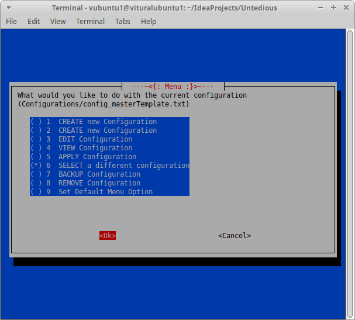

# Untedious
A GUI and smei-automated way to save your linux setups for fresh installs and VM's without backing up the entire system by locating installed software and packages. Created to make keeping settings and files just the way you want them more managable.

## Screenshots
*Last view of the program may lag behind latest release and may not change if only minor changes are implemented to the view*

## Disclaimer
This project is currently in pre-alpha, there are menus that have options that are not implemented yet. If you are going to apply any configurations you must agree to the warning.
